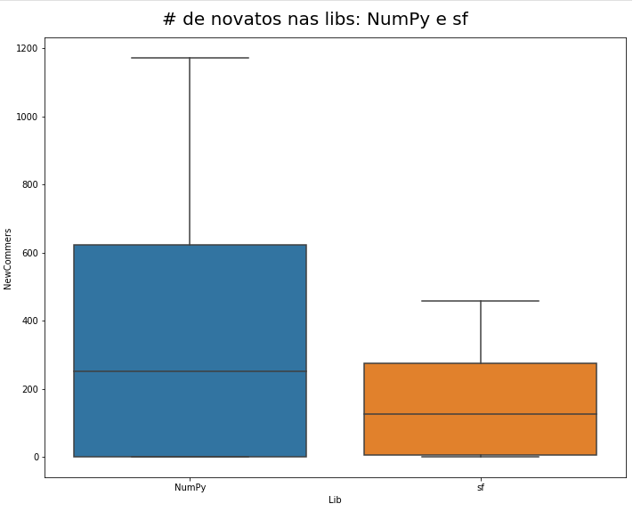
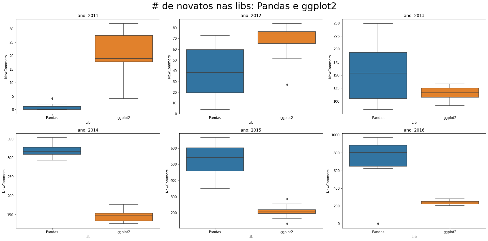

# Trabalho da Disciplina de Engenharia Empírica
Alunos: Alisson e Juan.

# Objetivo
Nosso objetivo, através desse trabalho, é realizar uma análise sob os dados do `stackoverflow`. Pretendemos coletar dados das perguntas e respostas do site, essa consulta podendo ser através de requisições a API, ou procurando dados públicos, entre outras formas de coleta. Com os dados coletados, pretendemos fazer uma seleção pelas perguntas sobre a linguagem de programação `python`, e sobre a linguagem de programação `r`. E ainda, sobre esses dados, planejamos, com base em alguma estimativa, analisar a quantidade de novatos em cada um dessas linguagens, e realizar as análises em cima desses dados. Esperamos através dessa pesquisa, encontrar fatores que possam mostrar diferenças entre o número de novatos nessas duas linguagens.
 
 # Desenvolvimento
 Nessa seção iremos abordar sobre alguns tópicos importantes quanto ao desenvolvimento da pesquisa.
 
 1. Linguagem utilizada para o desenvolvimento
 A linguagem de programação escolhida foi python, e iremos utilizar a `IDE jupyter notebook`, para fins de facilitar o desenvolvimento, e facilitar a reprodução dos nossos resultados. Esses podendo ser encontrados em um repositório no <a href="https://github.com/JuanFSR/EngenhariaEmpirica">github</a>.
 
 2. Conjunto de dados
 Em nossas buscas, encontramos dois conjuntos de dados do stackoverflow, já filtrados pela <a href="https://www.kaggle.com/datasets/stackoverflow/pythonquestions">linguagem de programação python</a> e pela <a href="https://www.kaggle.com/datasets/stackoverflow/rquestions"> linguagem de programação r</a>. Optamos por realizar as análises sob esses dados, pois enfrentamos diversas limitações ao utilizar a API, outra limitação foi a quantidade de <a href="https://archive.org/download/stackexchange">dados disponibilizados</a> pelo próprio stackoverflow, cerca de 50GB de perguntas obtidas, logo seria muito custoso realizar a filtragem nessa quantidade de dados. 
 
 3. Pré-processamento
Os dados obtidos continham cerca de 601.070 questões e 981.755 perguntas de python, e 188.729 questões e 250.000 perguntas de r. Entre esses dados, algumas colunas possuíam valores nulos, logo, foi realizado uma filtragem sob esses dados, afim de elimina-los.

 4. Definição de Veterano
Por fim, a métrica escolhida para a definição de um veterano foi que, as pessoas que fizeram alguma pergunta nos anos de 2008, 2009 e 2010, para ambas as linguagens, foram consideradas veteranos, e por consequente, aqueles que realizaram perguntas após esse período foram considerados novatos.

# Resultados
Inicialmente foi feito uma análise sobre as libs com mais novatos dessas linguagens, e sobre as libs com mais perguntas feitas por novatos.


</img>


</img>

Com esses dados, pegamos as 10 libs com mais novatos em ambas as linguagens e realizamos comparações entre elas. E são elas:
Python:
1. Numpy, com 35292 novatos
2. Pandas, com 20638 ovatos
3. Matplotlib, com 15906 novatos
4. Requests, com 15457 novatos
5. Pattern, com 11767 novatos
6. SciPy, com 9708 novatos
7. SQLAlchemy, com 5839 novatos
8. Selenium, com 5541 novatos
9. ScraPy, com 4219 novatos
10. OpenCV, com 3818 novatos

r:
1. sf, com 15310 novatos
2. ggplot2, com 12153 novatos
3. rio, com 10213 novatos
4. data.table, com 7339 novatos
5. dplyr, com 7323 novatos
6. zoo, com 3204 novatos
7. scales, com 2769 novatos
8. xml, com 2713 novatos
9. tmap, com 1605 novatos
10. OpenCV, com 1419 novatos

Desta comparação, já conseguimos notar que a linguagem de programação python tem mais novatos que a linguagem de programação r. Mas será que existe realmente uma diferença entre esses conjuntos? Essa foi a pergunta que esperamos responder através dos testes estatísticos.

### Testes Estátisticos
Utilizamos o teste `Mann-Whitney` com o propósito de verificar estatisticamente se há essa diferença entre o número de novatos na linguagem python e r, utilizando respectivamente cada biblioteca para realizar este teste. Em conjunto com o teste `Mann-Whitney`, foi utilizado o `Cohens' D` para medir o tamanho de efeito entre as duas médias.
Ao aplicar estes testes estátisticos, foi observado que para quase todas as bibliotecas, a nossa hipotése nula foi rejeitada, ou seja, estatísticamente há sim uma diferença entre a quantidade de novatos, apresentando uma diferença média significativa ou bastante significativa, como é possível observar abaixo.


</img>

Após executar estes testes observamos algo peculiar, apenas para as bibliotecas `Pandas` e `ggplot2` não encontramos que há uma diferença estatística entre a quantidade de novatos, comparando estas duas bibliotecas. Decidimos então analisar a quantidade de novatos em um escopo menor, neste caso, ano a ano. Temos como objetivo aplicar os testes estatísticos realizados anteriormente, para investigar como foi a distribuição de novatos que realizaram perguntas sobre essas bibliotecas e como isso muda ao decorrer dos anos. Abaixo podemos observar o boxplot da quantidade de novatos anulmente para as duas bibliotecas citadas anteriormente.


</img>

Para todos os testes realizados ano a ano, a nossa hipótese nula só não foi rejeitada no ano de 2013, ou seja, foi possível observar em quase todos anos que a quantidade de novatos é estatísticamente diferente, sendo que nos anos de 2011 e 2012 havia uma grande quantidade de novatos para a biblioteca `ggplot2` e uma quantidade inferior de novatos para a biblioteca `Pandas`, já no ano de 2013 a quantidade de novatos para as duas bibliotecas não é estatísticamente difente, porém, no ano de 2014 até o ano de 2016 vimos que a quantidade de novatos para a biblioteca `Pandas` é estatísticamente maior do que para a biblioteca `ggplot2`. Através destes testes podemos notar que no início a biblioteca `ggplot2` era mais utilizada, entretanto, com o passar dos anos, a popularidade da biblioteca `Pandas` só continuou a crescer, ultrapassando o número de novatos anualmente em relação ao `ggplot2`.

# Execução
É necessário fazer o clone do repositório no github, e executar o notebook, para que os resultados sejam exibidos.

```
git clone git@github.com:JuanFSR/EngenhariaEmpirica.git
```

Logo após, é necessário realizar o download das bases de dados. Para a base de dados do python, é necessário realizar o download no link abaixo.

```

https://www.kaggle.com/datasets/stackoverflow/pythonquestions

```

Após o download, é necessário extrair esses dados e colocar os arquivos '.csv' na pasta './data/python'. Já em relação aos dados do r, é necessário realizar o download no link abaixo.


```

https://www.kaggle.com/datasets/stackoverflow/rquestions

```  

Após o download, é necessário extrair esses dados e colocar os aquivos '.csv' na pasta './data/r'.
Após isso, basta executar os notebooks em ordem.
